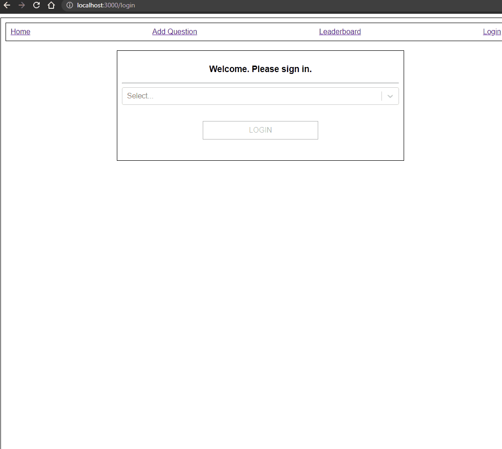

# Would You Rather?

This React Redux web app lets a user play the game “Would You Rather?”. A users can submit questions in the form “Would you rather [option A] or [option B]?”. When you log in you can answer these questions and see how other users voted as well. The more you engage the higher your score on the leaderboard.

Login flow             |  Voting flow
:-------------------------:|:-------------------------:
  |  

## Summary

- [Get Started](#get-started)
- [Data](#data)
  - [Users](#users)
  - [Questions](#questions)
  - [Voting Options](#voting-options)
- [Create React App](#create-react-app)
- [Author](#author)
- [License](#license)

## Get Started

To start the project
- in your terminal run `git clone https://github.com/ImmanuelXIV/react-wouldYou`
- install the project dependencies via `npm install`
- start the development server via `npm start`

## Data

There are two types of objects stored in our database:

* Users
* Questions

### Users

Users include:

| Attribute    | Type             | Description           |
|-----------------|------------------|-------------------         |
| id                 | String           | The user’s unique identifier |
| name          | String           | The user’s first name  and last name     |
| avatarURL  | String           | The path to the image file |
| questions | Array | A list of ids of the polling questions this user created|
| answers      | Object         |  The object's keys are the ids of each question this user answered. The value of each key is the answer the user selected. It can be either `'optionOne'` or `'optionTwo'` since each question has two options.

### Questions

Questions include:

| Attribute | Type | Description |
|-----------------|------------------|-------------------|
| id                  | String | The question’s unique identifier |
| author        | String | The author’s unique identifier |
| timestamp | String | The time when the question was created|
| optionOne | Object | The first voting option|
| optionTwo | Object | The second voting option|

### Voting Options

Voting options are attached to questions. They include:

| Attribute | Type | Description |
|-----------------|------------------|-------------------|
| votes             | Array | A list that contains the id of each user who voted for that option|
| text                | String | The text of the option |

Your code will talk to the database via 4 methods:

* `_getUsers()`
* `_getQuestions()`
* `_saveQuestion(question)`
* `_saveQuestionAnswer(object)`

1) `_getUsers()` Method

*Description*: Get all of the existing users from the database.  
*Return Value*: Object where the key is the user’s id and the value is the user object.

2) `_getQuestions()` Method

*Description*: Get all of the existing questions from the database.  
*Return Value*: Object where the key is the question’s id and the value is the question object.

3) `_saveQuestion(question)` Method

*Description*: Save the polling question in the database.  
*Parameters*:  Object that includes the following properties: `author`, `optionOneText`, and `optionTwoText`. More details about these properties:

| Attribute | Type | Description |
|-----------------|------------------|-------------------|
| author | String | The id of the user who posted the question|
| optionOneText| String | The text of the first option |
| optionTwoText | String | The text of the second option |

*Return Value*:  An object that has the following properties: `id`, `author`, `optionOne`, `optionTwo`, `timestamp`. More details about these properties:

| Attribute | Type | Description |
|-----------------|------------------|-------------------|
| id | String | The id of the question that was posted|
| author | String | The id of the user who posted the question|
| optionOne | Object | The object has a text property and a votes property, which stores an array of the ids of the users who voted for that option|
| optionTwo | Object | The object has a text property and a votes property, which stores an array of the ids of the users who voted for that option|
|timestamp|String | The time when the question was created|

4) `_saveQuestionAnswer(object)` Method

*Description*: Save the answer to a particular polling question in the database.
*Parameters*: Object that contains the following properties: `authedUser`, `qid`, and `answer`. More details about these properties:

| Attribute | Type | Description |
|-----------------|------------------|-------------------|
| authedUser | String | The id of the user who answered the question|
| qid | String | The id of the question that was answered|
| answer | String | The option the user selected. The value should be either `"optionOne"` or `"optionTwo"`|

## Author

- Immanuel Schwall - Software Engineer, Machine Learning, Web3

## Create React App

This project was created with [Create React App](https://github.com/facebookincubator/create-react-app).

## License
MIT License - see the [LICENSE.md](LICENSE.md) file for
details